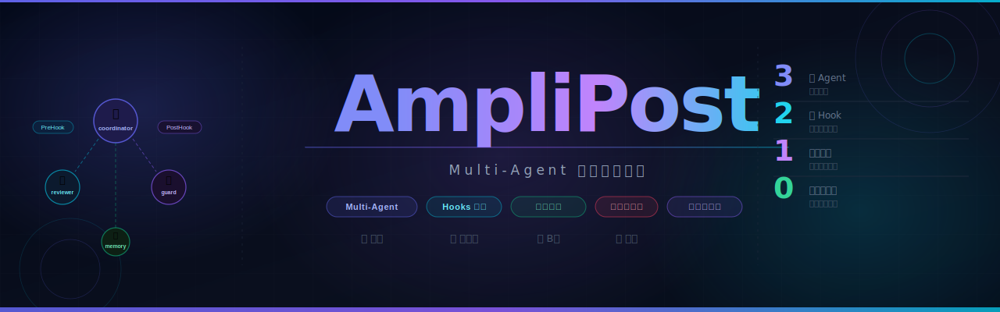
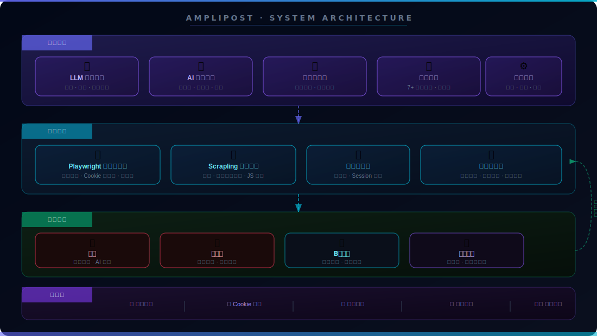
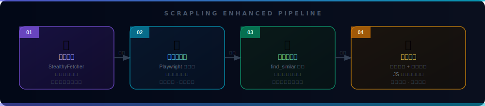

<div align="center">



<br>

[](LICENSE)
[](https://python.org)
[](https://playwright.dev)
[](https://github.com/D4Vinci/Scrapling)
[](https://openclaw.ai)
[](CONTRIBUTING.md)

<br>

**AmpliPost** 是面向内容创作者与营销团队的**智能营销中台**，将 LLM 内容生成、AI 配图、多平台自动投放、数据回流整合为一套完整的内容分发流水线。一句话指令即可完成从内容生产到全平台发布的全链路自动化，彻底释放重复性运营人力。

<br>

[快速开始](#-快速开始) · [中台能力](#-中台能力) · [平台矩阵](#-平台矩阵) · [系统架构](#-系统架构) · [Scrapling 增强](#-scrapling-反爬增强) · [项目结构](#-项目结构)

</div>

---

## 为什么需要营销中台

内容运营团队面临的核心矛盾是：平台越来越多，但人力没有同步增长。每个平台有独立的发布界面、不同的内容格式要求、各自的风控规则，手动运营的边际成本随平台数量线性增长。

AmpliPost 的答案是把「内容生产」和「平台投放」解耦，在中间建立一个统一的调度层——你只需要描述想发什么，中台负责生成内容、适配格式、绕过风控、完成投放，并将结果写回数据层供后续分析。

---

## 🧠 中台能力

<table>
<tr>
<td width="50%">

**内容生产层**

LLM 根据你的一句话描述，自动生成符合各平台调性的标题、正文和话题标签。AI 配图模块同步生成封面图与商品图，内置违禁词过滤词库在发布前完成自动替换，全程无需人工审核。

</td>
<td width="50%">

**投放执行层**

基于 Playwright 的真实浏览器引擎模拟人工操作行为，Cookie 持久化存储确保登录态长期有效。Scrapling 反爬引擎在每次投放前预检目标平台状态，自适应选择器在平台改版后自动降级适配。

</td>
</tr>
<tr>
<td width="50%">

**调度管理层**

支持定时发布、并发控制与失败自动重试。多账号 Session 管理允许同一平台维护多个账号矩阵，发布调度器统一管理任务队列，避免频率触发风控。

</td>
<td width="50%">

**数据回流层**

每次发布操作均写入结构化日志，包含时间戳、操作步骤、异常堆栈。内容归档模块保存历史发布记录，效果追踪模块为后续 A/B 测试提供数据基础。

</td>
</tr>
</table>

---

## 🚀 快速开始

### 安装依赖

```bash
# AI Agent 调度核心
npm install -g openclaw

# 浏览器自动化引擎
npm install -g agent-browser
agent-browser install

# Scrapling 反爬增强（强烈推荐）
pip install "scrapling[all]>=0.4.3"
scrapling install --force
```

### 一句话触发全链路

```bash
# 闲鱼商品上架
"帮我发布闲鱼：iPhone 15 Pro Max，5999元，95新，附上AI生成的商品图"

# 小红书种草笔记
"发一篇小红书：2025年最值得入手的5款AI工具，爆款风格，配3张图"

# B站深度专栏
"写一篇B站专栏：深度解析 Scrapling 反爬技术原理，1200字，技术向"

# 抖音图文
"发布抖音图文：职场效率提升的5个反直觉技巧，配图要有科技感"
```

### 直接调用增强版脚本

```bash
# 小红书（Scrapling 增强版，已测试）
python3 publishers/xhs-publisher/scripts/xhs_publish_scrapling.py \
    --title "2025年最值得入手的AI工具" \
    --content "今天分享5个改变我工作方式的AI工具..." \
    --images ./assets/cover.jpg \
    --tags "AI工具,效率提升,科技"

# 闲鱼商品发布
python3 publishers/xianyu-publisher/scripts/xianyu_publish_scrapling.py \
    --title "iPhone 15 Pro Max 256G" \
    --price 5999 \
    --condition "95新" \
    --description "自用，无划痕，配件齐全"
```

---

## 🎯 平台矩阵

<table>
<tr>
<th align="center" width="25%">🐟 闲鱼</th>
<th align="center" width="25%">📕 小红书</th>
<th align="center" width="25%">📺 B站专栏</th>
<th align="center" width="25%">🎵 抖音图文</th>
</tr>
<tr>
<td>

AI 生成商品配图<br>
自动发布上架<br>
违禁词过滤<br>
登录态持久化<br>
7+ 发货模板

</td>
<td>

爆款标题生成<br>
图片批量上传<br>
话题标签推荐<br>
文字配图模式<br>
Scrapling 增强 ✅

</td>
<td>

800–1500 字深度文章<br>
自动排版格式化<br>
草稿管理<br>
封面图生成<br>
专栏分类设置

</td>
<td>

短平快图文<br>
AI 智能配图<br>
创作者中心直发<br>
话题挂载<br>
定时发布支持

</td>
</tr>
</table>

---

## 🏗️ 系统架构



AmpliPost 采用四层中台架构。**内容中台**负责 LLM 驱动的内容生产、AI 配图、违禁词过滤与模板管理；**投放引擎**由 Playwright 浏览器引擎与 Scrapling 反爬引擎协同驱动，配合登录态管理与发布调度器完成实际投放；**平台矩阵**对接四大社交平台；**数据层**收集发布日志、Cookie 存储、内容归档与效果数据，通过数据回流通道反哺上层决策。

---

## 🕷️ Scrapling 反爬增强



标准 Playwright 自动化在面对平台改版或反爬升级时容易失效。Scrapling 增强层在其之上叠加四道防线：预检阶段通过 StealthyFetcher 验证目标页面可访问性；执行阶段由 Playwright 完成真实浏览器操作；选择阶段通过 `find_similar` 自适应降级，在 DOM 结构变化时自动寻找相似元素；容错阶段提供 JS 兜底方案与自动重试机制，并将完整异常信息写入日志。

| 平台 | 标准版 | Scrapling 增强版 |
|------|--------|-----------------|
| 📕 小红书 | `xhs_publish.py` | `xhs_publish_scrapling.py` ✅ 已测试 |
| 🐟 闲鱼 | `xianyu_publish.py` | `xianyu_publish_scrapling.py` |
| 📺 B站 | `bilibili_publish.py` | `bilibili_publish_scrapling.py` |
| 🎵 抖音 | `douyin_publish.py` | `douyin_publish_scrapling.py` |

---

## 📁 项目结构

```
amplipost/
├── README.md
├── LICENSE
└── publishers/
    ├── xianyu-publisher/          🐟 闲鱼
    │   ├── SKILL.md
    │   ├── scripts/
    │   │   ├── xianyu_publish.py
    │   │   ├── xianyu_publish_scrapling.py
    │   │   └── auto_publish.py
    │   └── references/
    │
    ├── xhs-publisher/             📕 小红书
    │   ├── SKILL.md
    │   ├── scripts/
    │   │   ├── xhs_publish.py
    │   │   └── xhs_publish_scrapling.py
    │   └── references/
    │
    ├── bilibili-publisher/        📺 B站专栏
    │   ├── SKILL.md
    │   ├── scripts/
    │   │   ├── bilibili_publish.py
    │   │   └── bilibili_publish_scrapling.py
    │   └── references/
    │
    └── douyin-publisher/          🎵 抖音图文
        ├── SKILL.md
        ├── scripts/
        │   ├── douyin_publish.py
        │   ├── douyin_publish_scrapling.py
        │   └── generate_images.py
        └── references/
```

---

## 🔧 故障排查

**登录态失效**

```bash
# 重新触发登录，Cookie 自动更新
"登录闲鱼" / "登录小红书" / "登录B站" / "登录抖音"
```

**发布失败**

```bash
# 查看浏览器当前状态
agent-browser snapshot

# 切换 Scrapling 增强版，鲁棒性更强
python3 xhs_publish_scrapling.py --title "标题" --content "内容"
```

**配图中文乱码（macOS）**

```bash
brew install font-morisawa
cp $(find /usr/fonts -name "*.ttc" | head -1) ~/Library/Fonts/
```

---

## 🤝 贡献

```bash
git checkout -b feature/your-feature
git commit -m 'feat: add your feature'
git push origin feature/your-feature
# 提交 Pull Request
```

---

## 📄 许可证

[MIT License](LICENSE) · © 2025 Alan Song & Roxy Li

---

<div align="center">

[](https://openclaw.ai)
[](https://playwright.dev)
[](https://github.com/D4Vinci/Scrapling)

*Built for creators · Designed for scale*

</div>
